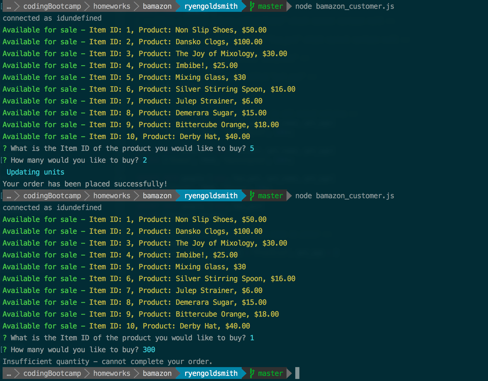
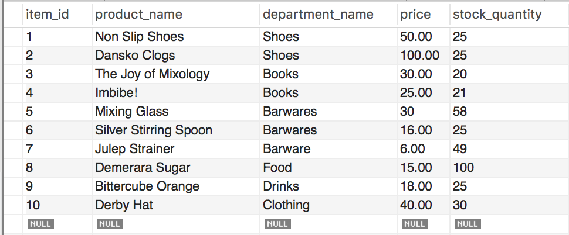
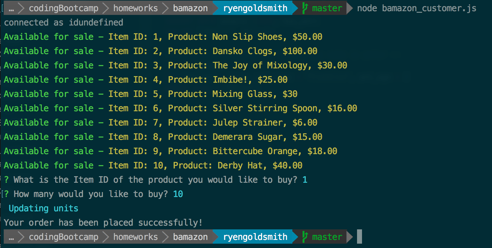
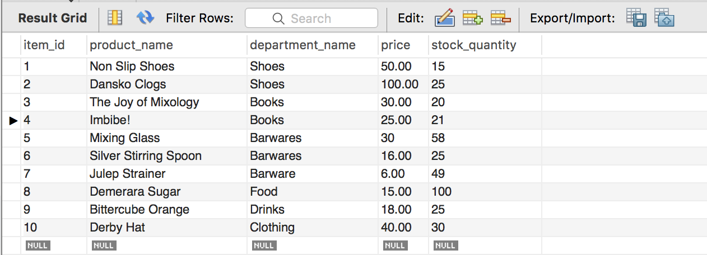

# bamazon
Node.js &amp; MySql exercise.

This goal of this project was to make a CLI "amazon" store that would display a number of items for sale that the user can buy.  It would then update on the MySql database what had been purchased.

Here's what the command line looks like when you want to make a purchase, it processes the order if you enter a proper amount, but will stop the purchase if there isn't enough inventory:

Then, here is the database before a purchase on the CLI:

Made a purchase for 10 pairs of shoes:

Then a screenshot of the databse afterwards:

